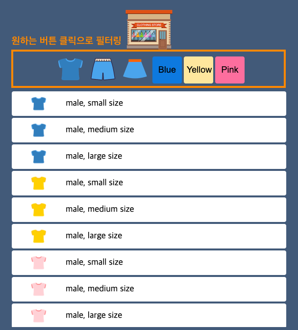
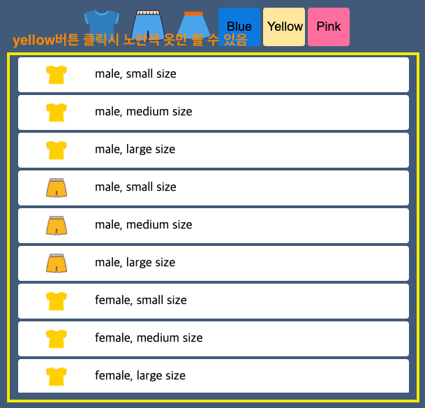

# mini-shopping-app

## 1. 개요
바닐라 자바스크립트(Vanila JS)를 사용하여 간단한 필터기능 구현.
Tshirt, Pants, Skirt, Blue, Yellow, Pink 버튼을 눌러 원하는 옷만 모아 볼 수 있음.

## 2. 스택
- HTML
- CSS
- JavaScript

## 3. 걸린시간
- 약 하루

## 4. 미리보기

 

## 5. 후기
드림코딩 앨리의 쇼핑미니게임 만들어보기 실습을 해보았다.
이번 실습을 진행한 이유는 몇 가지가 있다.
첫째, 개발공부의 초심을 잃지 않고 동기부여를 갖기 위해
둘째, 바닐라 자바스크립트 공부에 대한 필요성을 느끼고 있기 때문에
셋째, 간단하더라도 계속 코드를 짜보는 시간을 갖기 위해

이번 프로젝트를 하면서 간단한 페이지라도 마크업 전에 손으로 설계를 그려보는 습관을 갖는게
중요하다는 생각이 들었다. 그래야 스타일링 할 때에도 편하고 자바스크립트로 제어하는데 실수를 
줄일 수 있는 것 같다.

또 html 요소에 `data-` 속성을 주고 자바스크립트에서 dataset을 통해 조회할 수 있다는 걸 
처음 알았다. 이런 유용한 것들은 좀 더 찾아보고 익혀두어야 할 것이다.

css에서 `:root`에서 자주 사용하는 값을 변수처럼 지정하여 사용할 수 있다는 것도 이번에 다시 알게됐다.
변수 지정은 scss에서만 가능한 줄 알았는데 css에서도 가능한 걸 이제야 알게되었다. 자주 사용되는 스타일 값은
한 곳에 모아 관리해야 유지보수할 때 편리하다. 이번 프로젝트에서는 css 분량이 많지 않기때문에 굳이 변수로 지정할
필요는 없을 수도 있었지만 이런 습관을 들이는 것이 중요하다고 생각한다.

js에서는 `fetch()` 메소드를 사용하여 api에서 옷 데이터를 받아온다. 받아온 데이터(배열)를 `map`으로 나열하고 
각 버튼에 `addEventListener`를 추가한다. 각 버튼에 `data-key="xxx"`, `data-value="zzz"`를 추가해서
클릭 이벤트 발생시 `filter`메소드 실행에 사용한다는 점이 신기했다. 간단하면서 유용한 듯.

앨리님의 코드를 보고 어떤게 깔끔하고 좋은 코드인지 또 다시 배웠다. 누가봐도 보기 편하고 이해하기 쉬운 코드를 작성 할 수 있도록
계속 노력하고 보완해야 한다.
